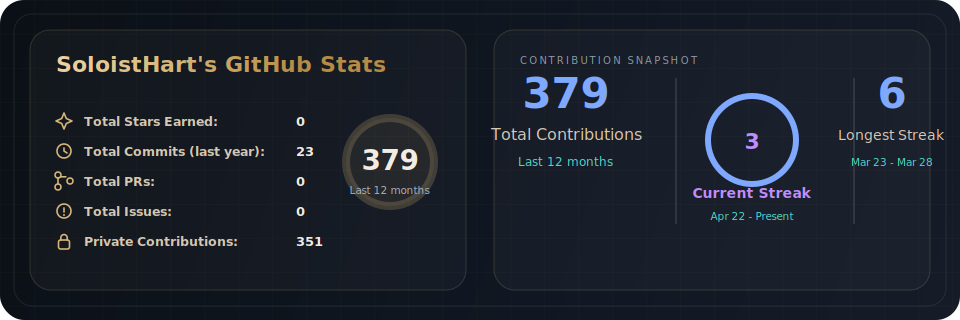

  

  <a href="mailto:martel.rhohart@gmail.com">Email</a>
  ·
  <a href="https://www.linkedin.com/in/rhohart-martel-4798ab307">LinkedIn</a>
  ·
  <a href="https://portfolio-hart.vercel.app">Portfolio</a>
  ·
  <a href="https://github.com/SoloistHart?tab=repositories">All repositories</a>

## Selected Systems

<table align="center">
  <tr>
    <td valign="top" width="33%">
      <strong><a href="https://github.com/SoloistHart/Portfolio-Hart">Portfolio-Hart</a></strong> 
      Premium portfolio foundation built with a calm editorial visual system and motion-aware frontend architecture.  
      <code>Next.js</code> <code>TypeScript</code> <code>Tailwind</code>
    </td>
    <td valign="top" width="33%">
      <strong>QA AI Behavioral Dashboard</strong> 
      AI-assisted QA system with KPI drilldowns, filtered exports, coaching insights, and PII-aware workflows for operations teams.  
      <code>React</code> <code>Node.js</code> <code>PostgreSQL</code>
    </td>
    <td valign="top" width="33%">
      <strong>Executive Productivity Dashboard</strong> 
      Executive-facing reporting product for audit trends, breakdowns, productivity tracking, and business-facing performance views.  
      <code>Next.js</code> <code>Node.js</code> <code>MariaDB</code>
    </td>
  </tr>
</table>

## Tech Stack

<table>
  <tr>
    <td align="center" width="20%"> TypeScript</td>
    <td align="center" width="20%"> React</td>
    <td align="center" width="20%"> Next.js</td>
    <td align="center" width="20%"> Node.js</td>
    <td align="center" width="20%"> PostgreSQL</td>
  </tr>
  <tr>
    <td align="center" width="20%"> MySQL</td>
    <td align="center" width="20%"> n8n</td>
    <td align="center" width="20%"> Docker</td>
    <td align="center" width="20%"> Tailwind CSS</td>
    <td align="center" width="20%"> GitHub</td>
  </tr>
</table>

## GitHub Stats

  

## Repository Feed

  
Open generated featured repositories

<!-- featured-projects:start -->
| Repository | Description | Primary Language | Stars | Last Updated |
| ---------- | ----------- | ---------------- | ----- | ------------ |
| [Portfolio-Hart](https://github.com/SoloistHart/Portfolio-Hart) | Premium portfolio foundation built with Next.js, TypeScript, and a motion-aware visual system. | TypeScript | 0 | 8 days ago |
| [hol-copilot-lab](https://github.com/SoloistHart/hol-copilot-lab) | Github Copilot: Dev Days laboratory | TypeScript | 0 | 6 days ago |
| [vibe-a-sheesh](https://github.com/SoloistHart/vibe-a-sheesh) | No description provided. | Python | 0 | 12 days ago |
<!-- featured-projects:end -->

