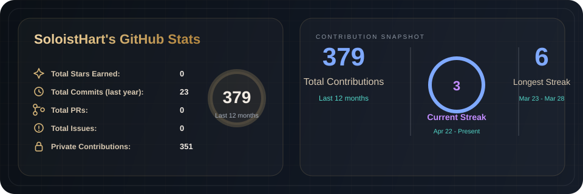

  

  <a href="mailto:martel.rhohart@gmail.com">Email</a>
  ·
  <a href="https://www.linkedin.com/in/rhohart-martel-4798ab307">LinkedIn</a>
  ·
  <a href="https://portfolio-hart.vercel.app">Portfolio</a>

I build AI systems for operations teams. Most of that work lives in private product repos.

## Selected systems

<table align="center">
  <tr>
    <td valign="top" width="33%">
      <strong>AI QA platform</strong> 
      Internal tooling that helps review conversations, score quality, and surface coaching notes.  
      <code>Python</code> <code>TypeScript</code>
    </td>
    <td valign="top" width="33%">
      <strong>QA analytics</strong> 
      Dashboards for QA metrics, filters, and exports used by operations teams.  
      <code>React</code> <code>Node.js</code>
    </td>
    <td valign="top" width="33%">
      <strong>Executive reporting</strong> 
      High-level views of audit trends and team productivity.  
      <code>Next.js</code> <code>SQL</code>
    </td>
  </tr>
</table>

## Tech stack

<table>
  <tr>
    <td align="center" width="20%"> Python</td>
    <td align="center" width="20%"> FastAPI</td>
    <td align="center" width="20%"> OpenAI</td>
    <td align="center" width="20%"> Gemini</td>
    <td align="center" width="20%"> PostgreSQL</td>
  </tr>
  <tr>
    <td align="center" width="20%"> TypeScript</td>
    <td align="center" width="20%"> React</td>
    <td align="center" width="20%"> Next.js</td>
    <td align="center" width="20%"> Docker</td>
    <td align="center" width="20%"> n8n</td>
  </tr>
</table>

## GitHub stats

  

